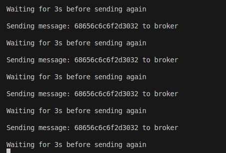

# TP IOT
## BRUN Xavier, HERZBERG Dwayne et BIENASSIS Jules 

### - Exercice 1

> Nous avons modiifié le **deveui** et lancé le programme.

> Modifié le **dr** permet de régler le **Spreading Factor**.

### - Exercice 3

> Si un message est envoyé sur une gateway, notre message sera transmis sur une des trames MQTT.

### - Execrice 4
Bah le mosquito marche pas donc on peut pas tester :)